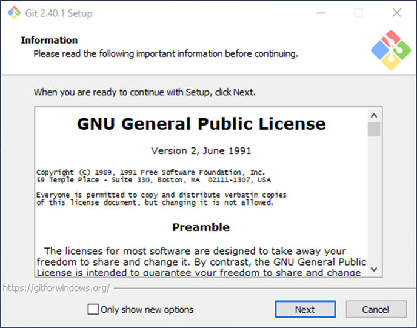
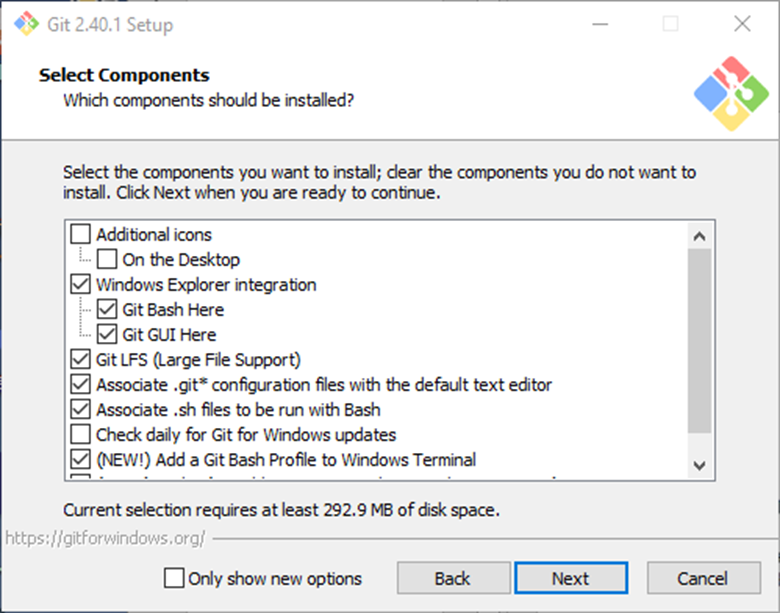
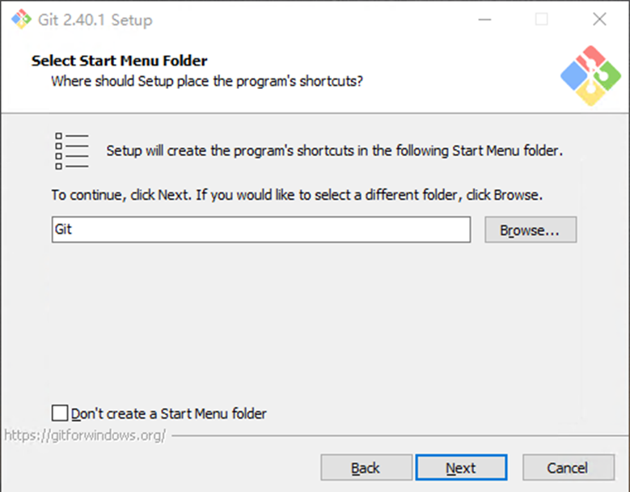
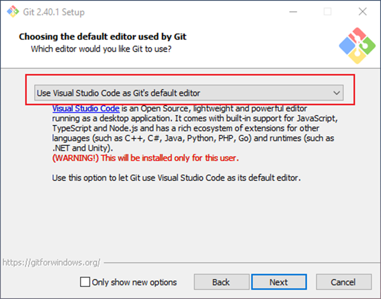
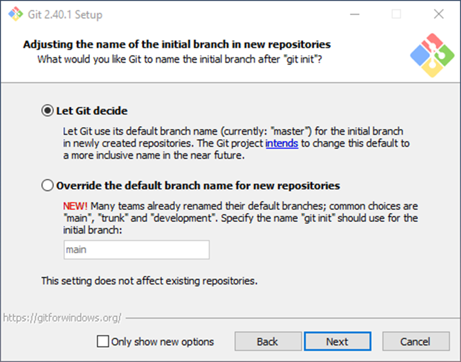
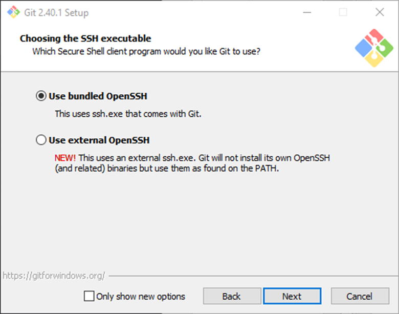
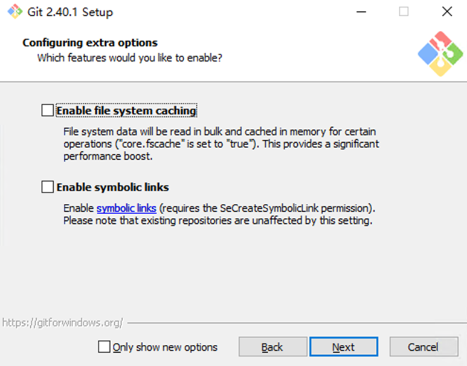
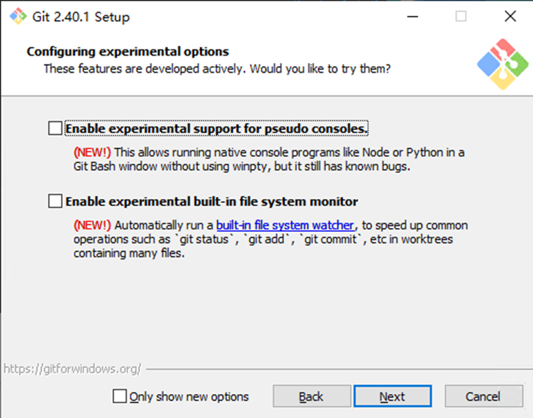

# 04.安装 Git

Git 安装非常简单，点击 [git-scm.com](http://git-scm.com/)，进入 Git 官网，点击 Download for Windows，点击64位Git安装程序，等待下载完毕之后，执行安装程序，默认安装即可。

等待安装完毕，在Terminal中输入 git version 命令，显示版本号，就表示已经安装成功了。

以下为Windows 安装步骤详细讲解

---

## 软件用户协议

Git 遵循 GNU 通用公共许可证，它是一种自由软件使用许可，它的存在是为了确保用户可以自由地使用、复制、修改和分发 Git 软件。通俗一点解释，你可以随便使用和修改软件，不过，你如果需要分发你的软件，也必须遵循这个许可，权利和义务对等。

## 选择软件安装路径

安装程序在某种程度上，可以看作是一个压缩包，选择安装路径等同于选择解压路径，将安装文件释放到选择的存储位置。但实际上，安装程序比普通的压缩包要复杂得多。安装程序通常包含了一个或多个文件、配置文件、注册表项、系统服务等等。这些文件和组件需要被提取并复制到正确的位置，以便软件能够在计算机上运行。此外，安装程序还会包括其他功能，例如：创建快捷方式、注册 DLL 文件、添加环境变量等等。

## 选择需要安装的组件或功能

- 第一项， 添加桌面图标;
- 第二项，添加开始菜单图标，它有两个子选项，一个是 Git Bash：这是一个在 Windows 上运行 Git 的命令行工具，提供了类似于 Unix/Linux 终端的命令行界面。另一个Git GUI：这是一个图形用户界面（GUI）工具，提供了可视化的方式来管理和操作 Git 仓库，适合那些不熟悉命令行界面的用户。
- 第三项，Git LFS：这是 Git Large File Storage 的缩写，是一个用于处理大型文件的 Git 扩展，允许将大型二进制文件存储在 Git 仓库中。就比如视频音频等文件存储到 Git 仓库。
- 第四项， 关联 .git 配置文件与系统的默认文本编辑器，选择这个可以用系统的默认的编辑器来编辑git的配置文件。
- 第五项 将SSH配置文件关联到系统的默认命令行解释器，当选择这个选项时，Git 安装程序会尝试将 ".ssh" 文件与系统中设置的默认 bash 解释器关联起来。这样，在后续使用 Git 进行 SSH 操作时，例如生成 SSH 密钥、配置 SSH 认证等，系统会自动使用默认的 bash 解释器来执行相关的命令。
- 第六项 检查更新，这个选项是指在安装 Git for Windows 过程中是否要设置每日检查 Git for Windows 更新的频率。当选择这个选项时，Git 安装程序会在每日检查是否有 Git for Windows 的更新版本可用。如果有更新版本，程序会提示用户进行更新，从而保持 Git for Windows 软件处于最新的状态，享受最新的功能和修复的 bug。
- 第七项，添加git bash 配置文件到windows terminal ，之前推荐大家下载 windows terminal，这个选项默认没有勾选上，我们可以选上，选上之后会在Windows Terminal中看到 Git Bash的选项卡。
- 最后一项， Scalar，Scalar 是一个 Microsoft 开发的用于改善大型 Git 仓库性能的开源工具。Scalar Git 客户端可以优化大型 Git 仓库的克隆、检出和提交等操作，从而提供更快的性能和更好的用户体验。具体实现以下功能，延迟加载，快照缓存，大文件处理，高效索引等功能。

## 选择开始菜单快捷方式创建路径

## 选择 Git 使用的默认编辑器

当 Git 需要使用编辑器时会调用这个选项，例如填写提交信息时。

## 主分支名称选择

- 第一项，让 Git 自行设置，默认名称 master。
- 第二项是自定义，在Git 2.28版本之后，Git的默认主分支名称从 "master" 更改为 "main"。这里我先给大家解释一下分支的意思，假如我们需要写一个文档，当写着写着，发现还有不同的写法，这时候，我们把这个文件重新复制一份，开始编写，这里最开始写的文档，可以理解为主分支，我们复制后开始写的另一份，就是原始文档的分支。分支名称用于区分不同版本以及不同功能，控制版本。

## 添加环境变量

- 第一项，只有Git Bash 能运行Git，

- 第二项，命令行(CMD或者 PowerShell)和第三方软件也可以运行 Git；
- 第三项，选择这个选项时，Git 安装程序将会安装一些类似于 Unix 工具的软件，例如 curl、grep、awk、sed 等。这些工具可以在 Git Bash 环境中使用，提供了类似于 Unix/Linux 系统中的命令行工具，使您能够在 Windows 系统中执行一些类似于 Unix/Linux 环境下的操作。

我再解释一下环境变量，环境变量是系统或用户定义的特殊变量，用来存储一些运行环境相关的信息。这些信息通常包含了一些路径、配置参数、编译器选项等，可供不同程序和进程使用。就以 Git 为例，默认选项会将 Git 的可执行程序目录添加到 PATH 中，这样我就可以在终端中调用 Git 所有的程序。

## 选择 SSH 可执行程序

SSH（Secure Shell）是一种网络协议，用于在不安全的网络中进行安全的远程访问和数据传输。第一项是Git已经集成的OpenSSH客户端程序，第二个选择系统已安装的SSH程序，常见的SSH客户端程序有 OpenSSH、PuTTY、SecureCRT等。在计算机领域中，不安全的网络通常指的是公共网络，例如互联网、无线局域网（WLAN）、蓝牙等。这些网络连接涵盖了广泛的用户和设备，并且往往没有进行足够的安全保护措施，容易被黑客或攻击者利用进行数据窃取、篡改或破坏。

## 选择 HTTPS 协议后端库

HTTPS（Hypertext Transfer Protocol Secure）是一种通过加密和认证的方式，使数据在网络传输过程中更加安全的通信协议。使用 HTTPS 进行 Git 仓库的访问可以提供更高的安全性，因为数据在传输过程中会被加密，防止中间人攻击和数据泄露。

当使用 "HTTPS" 作为 Git 的远程仓库访问方式时，通常需要提供远程仓库的 HTTPS URL，以及相应的用户名和密码（或者访问令牌）进行认证。这样在执行 Git 操作时，如克隆、推送、拉取等，Git 会通过 HTTPS 协议进行安全的数据传输和认证。选择 "HTTPS" 通常比较简单和方便，因为无需配置 SSH 密钥，适合那些不熟悉 SSH 密钥管理或不具备 SSH 服务器权限的情况。

"OpenSSL Library" 是一个开源的加密库，提供了多种加密和安全功能，包括 SSL/TLS 协议的实现。Git 可以使用 OpenSSL Library 作为其 HTTPS 通信的加密库，通过 HTTPS 协议进行安全的数据传输和认证。

"Native Windows Secure Channel library" 是 Windows 操作系统自带的安全通信库，用于实现安全通信协议，协议里包括 HTTPS。Git 可以使用 Windows 自带的 Secure Channel library 进行 HTTPS 通信。

这两个选项之间的选择通常取决于个人的偏好和需求。"OpenSSL Library" 是一个跨平台的开源库，适用于多种操作系统，而 "Native Windows Secure Channel library" 是 Windows 平台自带的库，可能对于在 Windows 环境下使用 Git，更加方便，集成度更高。选择哪个选项取决于用户的操作系统和安全需求。

## 操作系统文本文件行尾转换方式选择

在 Windows、Linux 和 macOS 等操作系统中，文本文件的行尾表示方式不同。Windows 使用 CRLF（回车换行）作为接尾，Linux 和 macOS 使用 LF（换行）作为结尾。这可能会导致在不同操作系统之间的文本文件在 Git 版本控制中出现行尾不一致的问题。

- 第一项，在检出文件时将行尾转换为 Windows 样式（CRLF），在提交文件时将行尾转换为 Unix 样式（LF）。适用于在 Windows 系统上开发但需要与 Linux 或 macOS 系统共享代码的项目。

- 第二项，不进行行尾转换，文件将按照原样从版本库检出，并在提交文件时转换为 Unix 样式（LF）。适用于在 Linux 或 macOS 系统上开发并与其他相同系统的项目共享代码。

第三项，不进行行尾转换，文件将按照原样从版本库检出并提交。适用于不需要处理行尾转换的项目。

## 设置Git Bash的终端模拟器

Git Bash 是一个在 Windows 系统上运行的命令行界面，它模拟了类似于 Linux 或 macOS 终端的功能，并提供了 Git 工具的命令行接口。终端模拟器是一种软件，用于模拟命令行界面，允许用户在图形化界面中输入和执行命令。

- 第一项，使用安装程序自带的终端Mintty , Mintty是一个基于 Cygwin 和 MSYS2 的终端模拟器，用于在 Windows 系统上运行类 Unix 环境下的命令行工具。它是 Git for Windows（也称为 Git Bash）默认使用的终端模拟器之一。

- 第二项，使用 Windows 默认的控制台窗口作为 Git Bash 的终端模拟器，例如 CMD 或者 PowerShell 命令行窗口

## 选择拉取远程仓库的默认方式

git pull 命令用于从远程仓库拉取代码并合并到当前分支。`git pull` 命令在默认情况下使用快速（fast-forward） 模式进行合并（merge）操作。这意味着如果当前分支是基于目标分支的直接上游分支（没有其他分支在其之间），也就是各个提交是线性的，中间没有其它分支混合。那么 **`git pull`** 命令会简单地将目标分支的提交合并到当前分支，从而快速前进（fast-forward）当前分支。

使用 fast-forward 合并模式的优点是合并历史简洁且线性，适用于在进行日常开发时，保持提交历史的整洁性和简单性。它适用于以下情况：

1. 当目标分支是当前分支的直接上游分支，且没有其他分支在其之间。
2. 当多个开发者在同一时间在不同的分支上进行独立的开发，并且没有冲突需要解决。
3. 当只需要将目标分支的提交合并到当前分支，并且不需要对提交历史进行复杂的修改。

另一方面，**`git pull`** 命令也可以使用合并（merge）模式进行合并操作，该模式会创建一个新的合并提交，包含了从目标分支合并到当前分支的所有提交，从而形成一个分支合并的提交历史。这种方式可能会导致提交历史较为复杂，包含了多个合并提交，不过在某些情况下可能是必要的，例如在解决合并冲突时或者需要保留详细的合并历史时。

在选择 **`git pull`** 命令的合并模式时，应根据具体的情况和团队的合作流程进行选择。如果希望保持提交历史简洁和线性，可以选择 fast-forward 模式。如果需要更详细的合并历史或者需要解决合并冲突时，可以选择合并模式。

第二项，选用rebase（覆盖） ，当使用 **`rebase`** 模式进行 **`git pull`** 操作时，Git 会尝试将当前分支的提交重新应用在目标分支的最新提交之上，而不是简单地创建一个新的合并提交。

使用 **`rebase`** 模式的主要优点是可以在提交历史中创建一个干净的、线性的合并历史，从而避免了创建多个合并提交的情况。这有助于保持提交历史的简洁性和可读性，减少了合并提交可能导致的提交历史混乱。

**`rebase`** 模式通常适用于以下情况：

1. 当目标分支有较新的提交，并且希望将当前分支的提交应用在最新的目标分支之上，以便保持提交历史的整洁性。
2. 当在进行多人协作开发时，希望将当前分支的提交整合到目标分支的最新提交之上，而不是创建多个合并提交。
3. 当需要对当前分支的提交进行覆盖（rebase）操作，以便合并到目标分支后的提交历史更加整洁和有序。

需要注意的是，使用 **`rebase`** 模式进行 **`git pull`** 操作可能会导致提交历史的改变，因为它会重新应用提交。因此，在选择使用 **`rebase`** 模式时，应谨慎处理可能涉及到的提交历史变更，并在团队中明确定义和遵循合作流程。

第三项 only ever fast-forward 模式

选择 "only ever fast-forward" 选项意味着在执行 **`git pull`** 操作时，Git 会尝试使用 "fast-forward" 方式进行合并，只有在当前分支的提交可以直接在目标分支的最新提交之上移动时才会执行合并。

"Fast-forward" 合并是一种简单的合并方式，它只是将当前分支的指针直接移动到目标分支的最新提交，从而使当前分支的提交历史保持线性，并且没有额外的合并提交。

选择 "only ever fast-forward" 选项适用于以下情况：

1. 当希望保持提交历史的线性，避免创建额外的合并提交。
2. 当确认当前分支的提交可以直接在目标分支的最新提交之上移动，并且不会导致合并冲突时。

需要注意的是，选择 "only ever fast-forward" 选项可能会导致 **`git pull`** 操作失败，如果当前分支的提交无法直接在目标分支的最新提交之上移动，例如存在合并冲突的情况。在选择该选项时，应确保当前分支的提交与目标分支的提交是兼容的，并且可以直接合并，以避免潜在的合并冲突。

## 选择个人凭据认证辅助工具

凭据辅助工具用于在执行 Git 操作时处理认证信息，例如用户名和密码，以便自动化地进行身份验证，而无需手动输入认证信息。

第一项，Git Credential Manager， 它可以帮助管理和存储 Git 认证信息，并在需要时自动提供认证信息。

第二项，None，不需要任何凭据辅助工具，每次需要认证时都需要手动输入用户名和密码。

## 额外选项

第一项文件缓存，文件系统缓存是一种优化技术，它可以在某些情况下显著提高 Git 的性能。当启用文件系统缓存时，Git 会将一些常用的元数据信息（例如文件状态、文件索引等）缓存到内存中，从而减少对硬盘的读写操作，从而提高 Git 命令的执行速度。

启用文件系统缓存可以在某些场景下对 Git 命令的执行速度带来显著的提升，例如在大型仓库或者频繁执行 Git 命令的情况下。然而，对于小型仓库或者不频繁执行 Git 命令的情况，文件系统缓存可能不会带来明显的性能提升。

需要注意的是，启用文件系统缓存可能会增加一些系统资源的消耗，例如内存和 CPU 使用率。因此，在选择是否启用文件系统缓存时，需要综合考虑你的系统配置和使用情况，权衡性能提升和资源消耗之间的关系。如果你对文件系统缓存不了解或者不确定是否需要启用，建议使用 Git 的默认配置，即不启用文件系统缓存。

第二项，软链接或者符号，它用于配置 Git 是否允许使用符号链接（symbolic links），软链接是一种创建一个指向另一个文件或目录的特殊类型文件的链接，类似于快捷方式。

启用符号链接选项意味着 Git 将允许在仓库中创建、使用和管理符号链接。这可以在某些情况下对 Git 仓库的管理和使用带来便利，例如在需要共享文件或目录时，避免重复复制文件的开销，或者在跨不同操作系统的环境中使用 Git 时需要处理符号链接。

需要注意的是，启用符号链接选项可能会涉及一些系统权限和兼容性方面的考虑。例如，在某些操作系统或文件系统上，创建和使用符号链接可能需要管理员权限或者特定的文件系统支持。因此，在选择是否启用符号链接选项时，需要考虑你的系统环境和使用需求，并确保了解符号链接的工作原理和限制。如果不了解或者不需要使用符号链接，建议使用 Git 的默认配置，即不启用符号链接。

## 实验选项

第一项伪控制台支持，伪控制台是一种在 Windows 系统上运行命令行应用程序时模拟的控制台环境，用于支持一些高级的终端特性，例如 ANSI 转义序列、颜色和光标控制等。

第二项，文件监控，用于启用内置的文件系统监视器。这个监视器可以在 Git 仓库中检测文件系统的变化，并在文件发生变化时自动更新 Git 的文件状态信息。

启用这个选项后，Git 将会监视仓库所在文件系统的文件和目录的变化，例如文件的创建、修改、删除等操作，并自动更新 Git 的文件状态信息，使得 Git 可以更准确地反映文件系统的最新状态。这可以帮助 Git 在处理文件状态变更时更加及时地更新仓库的状态，从而提高工作效率。

然而，需要注意的是，这个选项可能会对系统资源产生一定的影响，因为文件系统监视需要不断地检测文件系统的变化。在大型仓库或者文件系统变更频繁的情况下，启用这个选项可能会导致 Git 进程的资源占用较高。因此，在启用这个选项时，需要根据具体情况评估系统资源的使用情况，并根据实际需求来做出决策。

如果不需要实时监视文件系统的变化，或者对系统资源有限的情况下，也可以选择禁用这个选项，手动使用 Git 的命令来更新文件状态信息，如 `git status`、`git add`、`git rm` 等。
