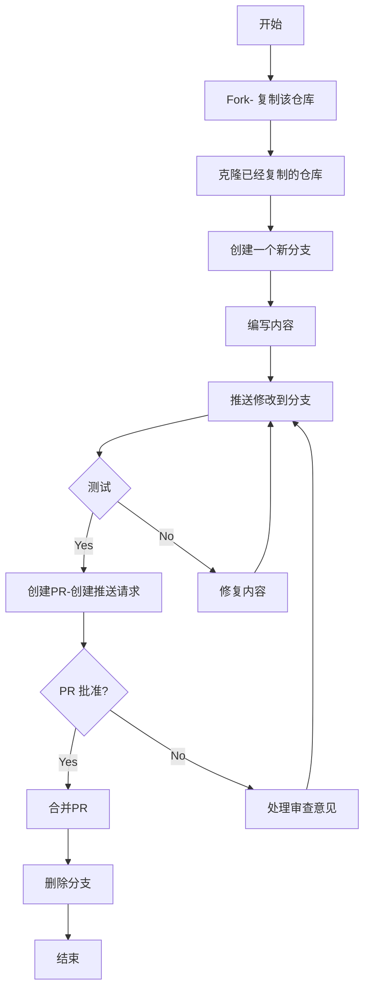
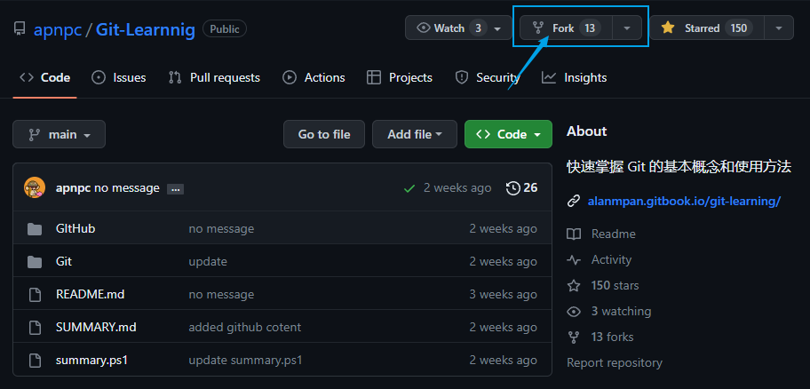
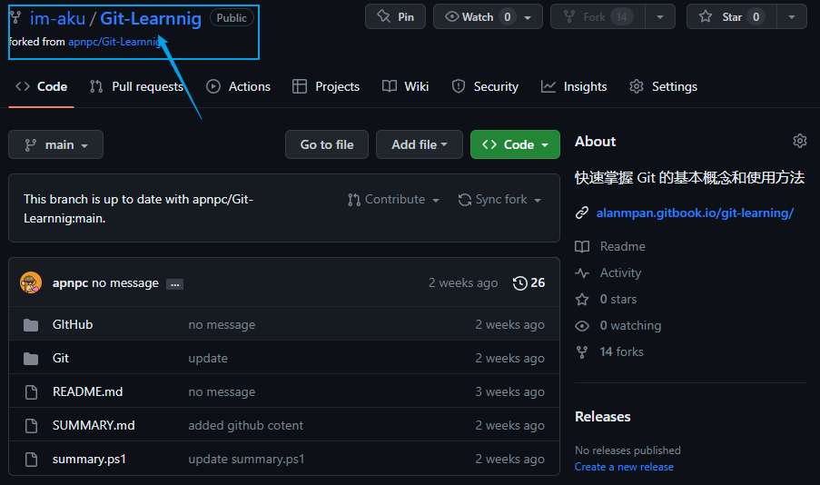
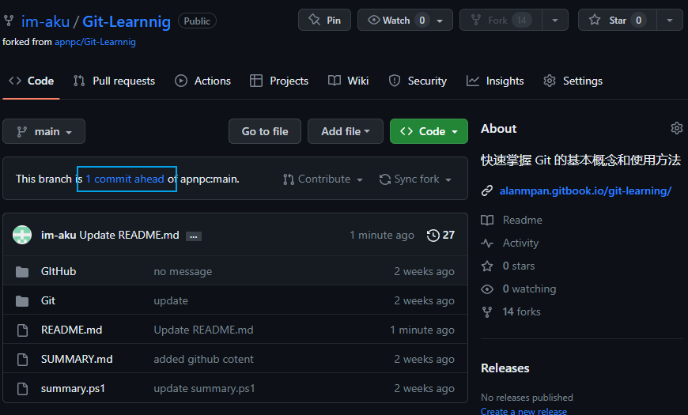

# 如何向他人的项目提交内容？

## 第一步 Fxxk 它

1. 进入你想参与的项目，点击右上角的 Fork

2. 之后会引导你创建一个属于你个人的一个仓库。
3. 创建完成之后，你可以在自己的仓库目录下看到你想参与的项目。

## 第二步 修改内容

接下来你可以将项目克隆到本地进行编辑修改，然后提交。这些内容在 Git 基础学习中已经阐述了，可以参考页头的流程图进行相应操作。

## 第三步 推送请求

> **Note**
>
> 推送前一定要多次验证

推送请求有两个方式：

1.再回到你 Fork 仓库项目目录，点击 `commit ahead`，会跳转到源项目，点击创建一个PR（create pull request），填写提交说明并提交，之后就是等待项目管理人员审核你的提交，审核通过或者不通过都会给你发消息。

2. 直接进入源仓库目录，点击目录上方的 `Pull requests`，按照引导完成提交。
