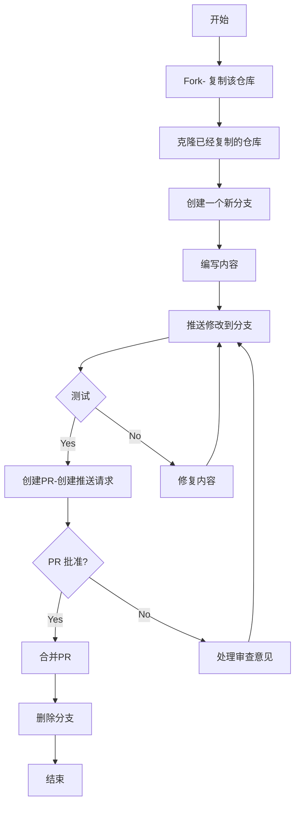

# 如何向他人的项目提交内容？

## 第一步 Fxxk 它

进入你想参与的项目，点击右上角的 Fork，之后会引导你创建一个属于你个人的一个仓库。创建完成之后，你可以在自己的仓库目录下看到你想参与的项目。

## 第二步 修改内容

接下来你可以将项目克隆到本地进行编辑修改，然后提交。这些内容在 Git 基础学习中已经阐述了，这里就不多说了。

## 第三步 推送请求

你提交的内容一定要多次验证，确保没有问题后，再回到你的仓库项目目录，点击 pull request，创建并一个PR（pull request），并提交，之后就是等待项目管理人员审核你的提交，审核通过或者不通过都会给你发消息。
