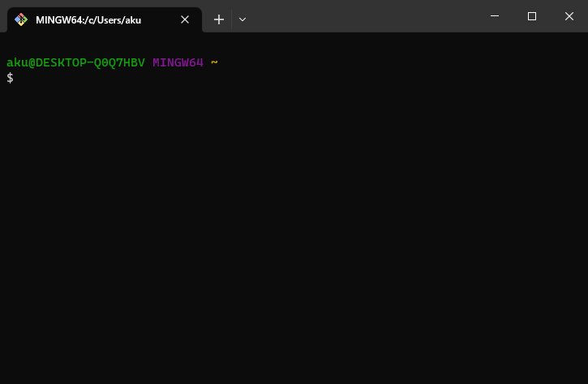
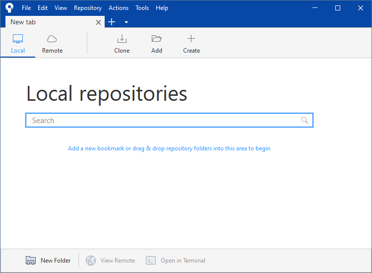
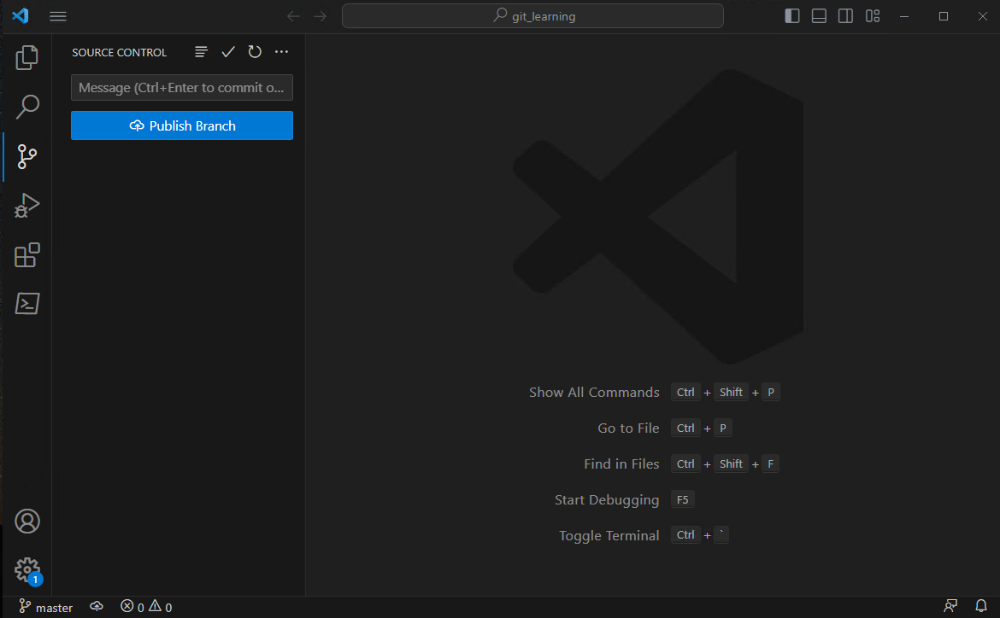

# 03.使用 Git 的方式

使用 Git 的方式有三种，分别是命令行、图形化软件以及IDE集成环境。

## 命令行

使用 git 命令与 Git 交互

## 图形化软件

使用图形化软件与 Git 交互，例如 [Sourcetree](https://www.sourcetreeapp.com/)

还有很多图形化软件，请查看 <https://git-scm.com/downloads/guis>

## IDE

## 另外推荐安装两个软件

1. WIndows Terminal，在微软应用商店就可以下载。
2. [VScode](https://code.visualstudio.com/)
