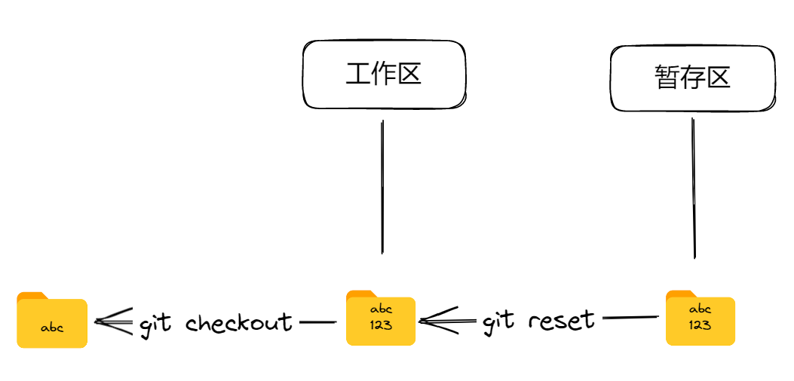

# 13.撤销修改-已暂存状态下



本节学习取消暂存：文件已经执行 `git add`，但尚未提交。先使用 `git status` 查看状态；需要回到实验主分支时执行 `git switch master`。

## 修改文件，并提交至暂存区

在 test 文件中添加一行 123，并保存。使用 `git add` 命令提交至暂存区。

```powershell
# 查看文件内容
$ cat .\test.txt
abc
123

# 添加到暂存区
$ git add test.txt

# 查看状态
$ git status
On branch master
Changes to be committed:
  (use "git restore --staged <file>..." to unstage)
        modified:   test.txt
```

## 重置暂存区

使用 `git restore --staged test.txt` 将文件移出暂存区，同时保留工作区修改。

```powershell
# 撤销暂存文件
$ git restore --staged test.txt
Unstaged changes after reset:
M       test.txt

# 查看状态
$ git status
On branch master
Changes not staged for commit:
  (use "git add <file>..." to update what will be committed)
  (use "git restore <file>..." to discard changes in working directory)
        modified:   test.txt

no changes added to commit (use "git add" and/or "git commit -a")
```

HEAD 是一个指针，它指向当前分支所在的提交。换句话说，它是指向当前工作目录所基于的最新提交的引用。在此处 HEAD 参数也可以省略。

## 恢复本地修改

现在要恢复文件状态，我们还得执行 [12.撤销修改-本地已保存状态](12-撤销未暂存修改.md)中的操作

```powershell
# 撤销暂存前更改
$ git restore test.txt

# 查看 Git 状态
$ git status
git status
On branch master
nothing to commit, working tree clean
```

## reset、restore 和 switch

现代 Git 把常见任务拆分成职责更明确的命令：

- `git restore`：恢复工作区或暂存区中的文件；
- `git switch`：切换或创建分支；
- `git reset`：移动当前分支，并根据模式选择是否更新暂存区和工作区。

`checkout` 仍可完成切换分支和恢复文件，但新教程优先使用 `switch` 与 `restore`，以减少误操作。

请注意，在使用这些命令之前，请务必先备份您的代码库并确保已经理解了命令所带来的影响。不正确使用这些命令可能会导致数据丢失或代码库处于不稳定状态。
