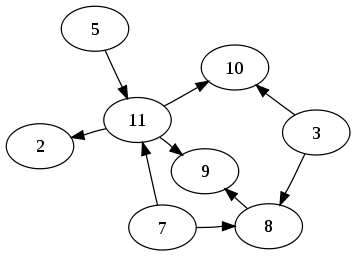

# 19.了解 Git 对象存储机制

Git 使用一种称为对象存储的机制来管理和处理所有文件和目录内容，以及它们之间的关系。

Git 对象存储机制包括以下几个方面：

1. Git 对象：Git 中的所有数据都被视为对象。一个对象可以是一个文件的内容（Blob）、目录结构（Tree）、提交记录（Commit）或标签（Tag）等。
2. 对象 ID：传统仓库使用 SHA-1，新仓库也可以选择 SHA-256。对象 ID 由对象类型、长度和内容共同计算。
3. Git 数据库：对象位于 `.git/objects`。松散对象按对象 ID 前两位分目录存储；打包后存入 `pack` 目录，不会按 blob、tree 等类型分别建立目录。

## Git 对象

Git 数据库包含多种对象，它们相互关联形成有向无环图（DAG）。每个对象由当前仓库格式对应的对象 ID 标识，并存储在 `.git/objects` 中。

Git 对象包括四种主要类型：blob、tree、commit 和 tag。

### Blob

Blob 对象代表文件内容。它包含原始内容，不包含文件名；文件名和模式保存在 tree 对象中。

### Tree

Tree 对象代表目录结构。它可以包含多个 blob 或其他 tree 对象，以及文件名和模式等信息。Tree 与其他对象一样按对象 ID 存储，并不存在 `.git/objects/trees` 类型目录。

### Commit

Commit 对象代表一次提交，包含作者、提交者、时间、提交信息、顶层 tree 和父提交等信息。

### Tag

Tag 对象是附注标签创建的对象，可以指向 commit 或其他对象，并包含标签名、标签者、说明和目标对象 ID。轻量标签只是引用，不创建 tag 对象。

这些 Git 对象之间的关系构成了一个有向无环图（DAG），每个节点都是一个对象，每个边表示一个指针。Git 使用这种数据结构来跟踪代码库的历史记录和变化，并支持分支、合并、撤销和回滚等操作。


## 实验

`git cat-file` 命令在 Git 中是一个非常有用的工具，特别是对于那些需要深入了解 Git 内部机制的开发人员和高级用户来说。`git cat-file` 命令通常用于以下两种情况：

1. 调试 Git 内部存储：如果您需要深入了解 Git 的内部工作方式，或者需要调试 Git 存储机制中的某些问题，则可以使用 `git cat-file` 命令查看 Git 对象的类型和内容。例如，您可以使用 `git cat-file -p <commit-SHA>` 命令来查看一个提交对象的详细信息，包括其作者、时间、提交消息等。
2. 验证对象：可以使用 `git cat-file -e <object-id>` 检查对象是否存在，或用 `-t`、`-p` 查看类型和内容。真正丢失的对象需要从其他克隆或备份恢复。

我们现在开始实验

### 找到最新一条提交记录

```powershell
# 查看最近一条提交日志
$ git hist --max-count=1
* 5dc8b1e 2023-05-05 | Added .gitignore (HEAD -> master) [aku]
```

### 查看提交对象的类型和对象的内容

`-p`：查看对象内容
`-t`：查看对象类型

```powershell
# 查看对象类型
$ git cat-file -t  5dc8b1e
commit

# 查看对象内容
$ git cat-file -p 5dc8b1e
tree 8b1db75acbd6f424e485953d3b4b8fb0de2f9065
parent b77158ade22b7ec01d29dde4c2e20df0ed2008ec
author aku <aku@example.com> 1683342959 -0700
committer aku <aku@example.com> 1683342959 -0700

Added .gitignore
```

- `Tree`：该提交所指向的树对象 ID。
- `Parent`：该提交的父提交对象 ID，合并提交可能有多个父提交。
- `Author`：该提交的作者姓名和电子邮件地址，以及提交时间戳。
- `Committer`：该提交的提交者姓名和电子邮件地址，以及提交时间戳。
- `Added .gitignore`：提交信息。

### 探索

```powershell
# 这里的哈希值，是上一步查看最新提交的 tree 哈希
$ git cat-file -p 8b1db75
100644 blob cb266c781c016fa3ae0be3bab90e71145dc6b09c    .gitignore
040000 tree 652058dd2d8057d2d79049dd3aa7a9f4e69d5e89    lab

# 查看 lab 文件夹的哈希
$ git cat-file -p 652058d
100644 blob 0605515085232c2911ca5e6c407da497c51a5c74    test.txt

# 查看 test 的哈希
$ git cat-file -p 060551
abc
123456
```

> `100644` 是一种文件模式，也称为文件权限或 Unix 文件模式。 `6` 表示所有者可以读取和写入该文件，但不能执行。  `4` 表示组用户可以读取该文件，但不能写入或执行。   `4` 表示其他人可以读取该文件，但不能写入或执行。
> 在 Unix 系统中，文件权限由一组三个数字表示，分别代表文件所有者、组用户和其他人的文件权限。每个数字表示一个具体的权限：-   `0`：无权限。-   `1`：执行权限。-   `2`：写入权限。-   `3`：写入和执行权限。-   `4`：读取权限。-   `5`：读取和执行权限。-   `6`：读取和写入权限。-   `7`：读取、写入和执行权限。
> 例如上文中的 `644` 表示以下内容：文件所有者可以读写该文件（`6 = 4 + 2`）。组用户可以读该文件（`4`）。 其他人可以读该文件（`4`）。
> 以下是一些常见的 Git 文件模式及其含义：-   `040000`：子目录。-   `120000`：符号链接。-   `160000`：Git 子模块。-   `33188` 或 `100644`：普通文件（文件权限为 `-rw-r--r--`）。-   `33261` 或 `100755`：可执行文件（文件权限为 `-rwxr-xr-x`）。

Git 对象可以帮助我们跟踪文件的历史记录和变化，并在需要时恢复旧版本的文件或比较不同版本之间的差异。在 Git 中，提交、树和文件内容都有各自的对象 ID，并以这些 ID 相互关联。通过使用 [`git log`](09-设置别名.md)、`git cat-file` 等命令，可以查看对象内容并理解仓库历史。
