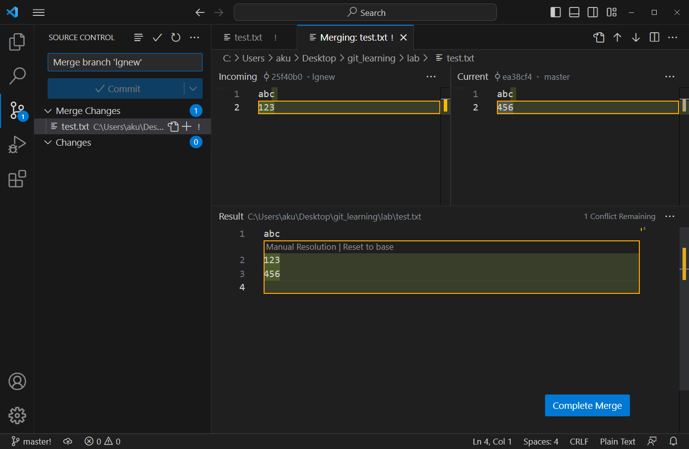

# 22.合并冲突

在 Git 中，当尝试将两个不同的分支合并时，可能会出现合并冲突。这通常发生在两个分支上都更改了同一文件的同一部分时。

## 实验

### 制造冲突

```powershell
# 切换到新分支
git switch lgnew

# 编辑test文件，添加一行内容 123,并提交
cat .\lab\test.txt
abc
123
git commit -a -m "added 123 to the test.txt"

# 切换回主分支
git switch master

# 编辑 test 文件，添加一行内容 456，并提交
cat .\lab\test.txt
abc
456
git commit -a -m "added 456 to the test.txt"

# 合并
git merge lgnew
Auto-merging lab/test.txt
CONFLICT (content): Merge conflict in lab/test.txt
Automatic merge failed; fix conflicts and then commit the result.
```

### 合并冲突

合并冲突需要手动解决。使用 `git status` 查看冲突文件，再在编辑器中处理 `<<<<<<<`、`=======` 和 `>>>>>>>` 标记。



VS Code 可以辅助选择或组合两侧内容，但最终仍应检查结果，并使用 `git add` 标记冲突已经解决。

```powershell
$ git status
$ git add .\lab\test.txt
$ git commit -m "Resolved merge conflict"

$ git hist
*   64e4a16 2023-05-05 | Resolved merge conflict (HEAD -> master) [aku]
|\
| * 25f40b0 2023-05-05 | added 123 to the test.txt (lgnew) [aku]
* | ea38cf4 2023-05-05 | added 456 to the test.txt [aku]
* | edee6c9 2023-05-05 | Revert "Merge branch 'lgnew'" [aku]
* | 22c6905 2023-05-05 | Merge branch 'lgnew' [aku]
```

如果不想继续本次合并，可以在提交前执行：

```powershell
git merge --abort
```
