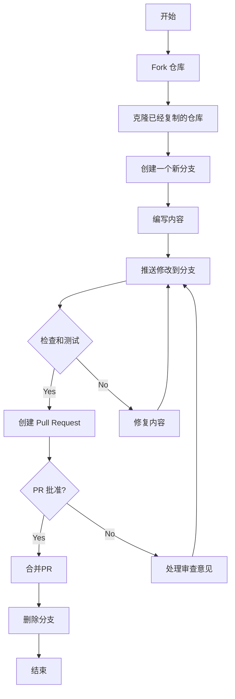
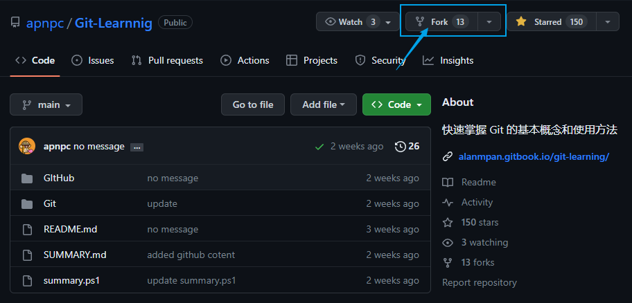
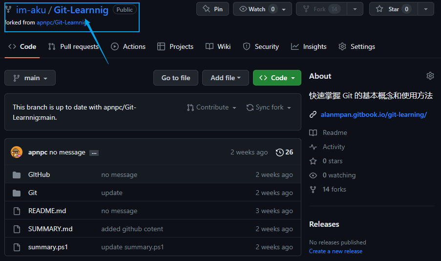
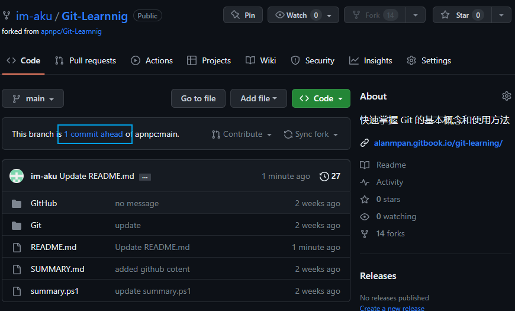

# 如何向他人的项目提交内容？

## 第一步 Fork 仓库

1. 进入你想参与的项目，点击右上角的 Fork

2. 之后会引导你创建一个属于你个人的一个仓库。
3. 创建完成之后，你可以在自己的仓库目录下看到你想参与的项目。

## 第二步 修改内容

接下来你可以将项目克隆到本地进行编辑修改，然后提交。这些内容在 Git 基础学习中已经阐述了，可以参考页头的流程图进行相应操作。

## 第三步 创建 Pull Request

> **Note**
>
> 推送前一定要多次验证

Pull Request 是请求原项目维护者拉取、审查并合并你的分支，不是“推送请求”。常见创建方式有两种：

1. 回到你 Fork 的仓库，点击分支领先提示或 `Contribute`，选择 `Open pull request`，确认源分支和目标分支后填写说明。

2. 进入源仓库的 `Pull requests` 页面，选择 `New pull request`，再选择你 Fork 中的分支进行比较。

审查期间继续向同一分支推送提交，Pull Request 会自动更新。合并后删除功能分支，并从源仓库同步最新主分支。
