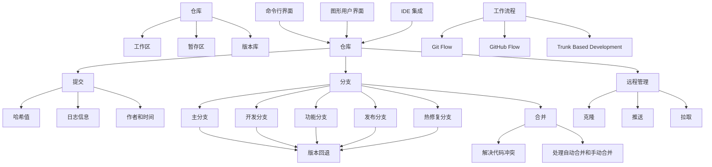

# README

## 目的

本课程旨在为初学者提供一个全面而简洁的介绍，让你快速掌握 Git 的基本概念和使用方法。无论你是一名软件开发新手、项目经理还是对版本控制感兴趣的任何人，本课程都将为你建立起坚实的Git基础。

主打的就是一个简单，每个小节都涉及到 Git 的核心知识，并有相关的实验，相信你在阅读完后会对 Git 有一个比较全面的认识。

## 注意事项

1. 本教程基于 Windows 10 操作系统，Git 版本 version 2.40.1.windows.1
2. 必须动手，请按照实验内容自己敲一遍；
3. 请配合 Git 官方书籍 [《Git pro》](https://git-scm.com/book/zh/v2)查缺补漏；
4. 命令展示说明

```PowerShell
# 这条是注释
$ 这条是命令
  这条是命令的输出内容
```

## 图谱



