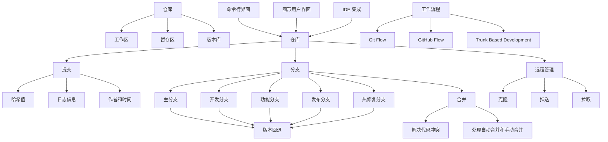

# Git Learning

## 目的

本课程面向 Git 初学者，先建立工作区、暂存区、提交、分支和远程仓库的完整模型，再通过实验掌握常用操作。

主打的就是一个简单，每个小节都涉及到 Git 的核心知识，并有相关的实验，相信你在阅读完后会对 Git 有一个比较全面的认识。

## 注意事项

1. 示例主要使用 PowerShell。不同系统的路径写法可能不同，但 Git 命令相同；
2. 必须动手，请按照实验内容自己敲一遍；
3. 示例中的提交哈希仅用于说明，请使用自己仓库产生的哈希；
4. 请配合 Git 官方书籍 [《Pro Git》](https://git-scm.com/book/zh/v2)查缺补漏；
5. 执行 `reset --hard`、rebase 或历史清理前，先阅读对应章节的风险说明。

## 开始学习

- [完整目录](SUMMARY.md)
- [基础篇](Git/01-初识-Git.md)
- [GitHub 协作](GitHub/01-向他人项目贡献.md)
- [高级篇](Advanced/README.md)

提交文档前运行：

```powershell
python check_docs.py
```

```powershell
# 这条是注释
$ 这条是命令
  这条是命令的输出内容
```

## 图谱


```mermaid
graph TD
  A[仓库] --> B[提交]
  A --> C[分支]
  A --> D[远程管理]
  C --> E[主分支]
  C --> F[开发分支]
  C --> G[功能分支]
  C --> H[发布分支]
  C --> I[热修复分支]
  B --> J[哈希值]
  B --> K[日志信息]
  B --> L[作者和时间]
  C --> M[合并]
  D --> N[克隆]
  D --> O[推送]
  D --> P[拉取]
  E --> Q[版本回退]
  F --> Q
  G --> Q
  H --> Q
  I --> Q
  M --> R[解决代码冲突]
  M --> S[处理自动合并和手动合并]
  T[工作流程] --> U[Git Flow]
  T --> V[GitHub Flow]
  T --> W[Trunk Based Development]
  X[命令行界面] --> A
  Y[图形用户界面] --> A
  Z[IDE 集成] --> A
  1[仓库] --> 2[工作区]
1[仓库] --> 3[暂存区]
1[仓库] --> 4[版本库]


```
